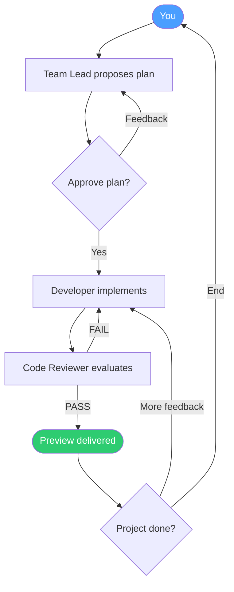

<div align="center">

# Bit Office

### Pixel office for AI agents and multi-agent collaboration

[](https://www.npmjs.com/package/bit-office)
[](https://opensource.org/licenses/MIT)
[](https://nodejs.org/)
[](https://github.com/longyangxi/bit-office/pulls)

**Watch your AI agents work together in a pixel-art office. Claude, Codex, Gemini, Aider — one team, one flow.**

[Quick Start](#-quick-start) | [Features](#-features) | [Team Workflow](#-team-workflow) | [Architecture](#-architecture) | [Contributing](#-contributing)

</div>

---

<video src="https://github.com/user-attachments/assets/a13ac1a0-8440-49f1-ab1e-110a35847d0c" controls width="100%"></video>

## What is Bit Office

Bit Office gives AI automation a **visible, controllable workspace**. Different AI models collaborate as one team under a Team Leader — planning, coding, reviewing, and delivering in a single flow, all rendered in a live pixel-art office you can watch, control, and share.

## Quick Start

```bash
npx bit-office
```

That's it. This will:

1. Start a local gateway daemon
2. Open the pixel-art office UI in your browser
3. Auto-detect installed AI CLIs (Claude, Codex, Gemini, Aider, OpenCode)
4. Generate a pair code for mobile access

## Features

### Multi-Agent Team Execution

A **Team Leader** coordinates specialists to tackle complex tasks. The Developer implements, the Code Reviewer validates, and the cycle continues until quality standards are met — all automated.

### Multi-Model Collaboration

Combine **Claude, Codex, Gemini, Aider, and OpenCode** in one workflow. Each agent plays to its strengths while the orchestrator keeps everything in sync.

### Live Visual Workspace

A pixel-art office rendered with PixiJS shows real-time agent status, logs, and progress. Pick from **12 themed office skins** — cyberpunk, gothic, sci-fi, nostalgic, and more.

### Ship-First Feedback Loop

Every completed task generates an **auto preview** — static HTML, build output, or a running dev server. Review results instantly without leaving the interface.

### Cost & Token Visibility

Track token usage **per agent and per team** in real time. Know exactly what each model run costs before it adds up.

### Shareable & Mobile-Ready

- **Live sharing**: Invite others to watch progress and leave feedback that agents can incorporate
- **Mobile control**: Pair your phone and manage sessions from anywhere
- **Cross-device**: WebSocket, Ably, and Telegram channels for real-time sync

### Project History

Every completed run is saved with a replayable preview. Browse past sessions, compare approaches, and build on previous work.

## Team Workflow



| Phase | What Happens | Your Action |
|---|---|---|
| **Create** | Team Lead gathers intent and scope | Describe what to build |
| **Design** | Team Lead proposes implementation plan | Approve or request changes |
| **Execute** | Developer implements, Reviewer validates | Monitor or cancel |
| **Complete** | Preview and summary delivered | Give feedback or end project |

Full details in [team-workflow.md](team-workflow.md).

## Use Cases

- **AI-native prototyping** — go from idea to working preview in one session
- **Feature spikes** — rapid implementation with continuous preview feedback
- **Multi-model experiments** — compare how different AI backends approach the same task
- **Live demos** — show autonomous development workflows to your team or audience

## Run from Source

### Prerequisites

- **Node.js** 18+
- **pnpm**
- At least one AI CLI installed: `claude`, `codex`, `gemini`, `aider`, or `opencode`

### Setup

```bash
git clone https://github.com/longyangxi/bit-office.git
cd bit-office
pnpm install
pnpm dev
```

### Scripts

| Command | Description |
|---|---|
| `pnpm dev` | Web + gateway in dev mode |
| `pnpm dev:web` | Web only (Next.js) |
| `pnpm dev:gateway` | Gateway only |
| `pnpm build` | Build all packages |
| `pnpm start` | Build web and start gateway |

### Environment Variables

| Variable | Required | Description |
|---|---|---|
| `WORKSPACE` | No | Agent working directory |
| `ABLY_API_KEY` | No | Remote real-time channel |
| `TELEGRAM_BOT_TOKENS` | No | One token per bot/agent (comma-separated) |
| `WEB_DIR` | No | Override served web build directory |

## Architecture

```
bit-office/
├── apps/
│   ├── web/            # Next.js PWA + PixiJS pixel office + control UI
│   └── gateway/        # Runtime daemon: events, channels, policy, orchestration
└── packages/
    ├── orchestrator/   # Multi-agent execution engine
    └── shared/         # Typed command/event contracts (Zod schemas)
```

**Channels**: WebSocket (always on), Ably (optional), Telegram (optional)

## Tech Stack

- **Frontend**: Next.js 15, React, PixiJS v8, Zustand
- **Backend**: Node.js daemon, WebSocket
- **Protocol**: Zod-validated event schemas
- **Integrations**: Ably, Telegram, external process detection

## Contributing

Issues and PRs are welcome. If you're exploring AI-native dev tooling, workflows, or interfaces, Bit Office is a great playground for experiments.

## Acknowledgments

Pixel office art inspired by [pixel-agents](https://github.com/pablodelucca/pixel-agents) by [@pablodelucca](https://github.com/pablodelucca).

## License

[MIT](LICENSE) - feel free to use, modify, and distribute.

---

<div align="center">

**If Bit Office helps your workflow, consider giving it a star!**

</div>
