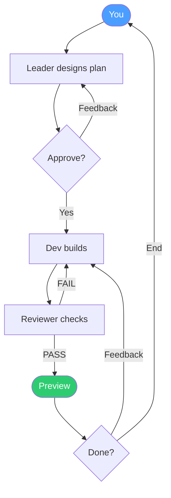

# Bit Office

Run your own AI startup — in a pixel office.

Hire AI agents, describe what you want, and watch a team of AI CLIs plan, code, review, and deliver a working prototype. You're the CEO; they do the work.

<video src="https://github.com/user-attachments/assets/a13ac1a0-8440-49f1-ab1e-110a35847d0c" controls width="100%"></video>

## Why Bit Office?

Using one AI CLI is powerful. Running a **team** of them is something else:

- **"Build me a game"** → Leader designs the concept, developer writes all the code, reviewer catches bugs, you get a playable prototype
- **Mix models freely** — Claude Code writes, Codex reviews, Gemini tests. Each agent runs whichever AI CLI you choose
- **Access anywhere** — Desktop browser, mobile PWA (pair with 6-digit code), Ably for remote, or Telegram bots. Approve risky commands from the couch, check progress on the bus
- **Immersive CLI experience** — Already running Claude Code or Codex in your terminal? Bit Office auto-detects them and streams the live conversation into your pixel office — watch, approve, and read output all in one place
- **See them work** — Pixel characters animate in a 2D office while agents think, delegate, and debate. Customize your office with the drag-and-drop editor

## Quick Start

```bash
npx bit-office
```

Opens a browser UI, auto-detects installed AI CLIs, generates a pair code for your phone.

## Features

### Core

- **Multi-Agent Teams** — Leader + Developer + Reviewer collaborate on one project with structured delegation
- **Mix & Match AI CLIs** — Claude Code, Codex, Gemini, Aider, OpenCode — assign any CLI to any role
- **Live Preview** — Static HTML, build output, or running processes served automatically when work completes
- **Approval System** — Risky commands trigger Yes/No bubbles you can approve from desktop or phone

### Team Workflow



Three loops keep things moving:
- **Design loop** — Leader proposes a plan, you refine it until you're happy, then approve
- **Review loop** — Reviewer catches bugs or missing features, Dev fixes (up to 3 cycles)
- **Feedback loop** — You preview the result and request changes, or end the project and start fresh

The leader acts as Creative Director — designing the product vision (theme, style, user experience), not just listing technical tasks. After you approve, the team executes autonomously with built-in review cycles and budget safeguards.

## How Teams Work

### Phases

| Phase | What happens | You can... |
|-------|-------------|------------|
| **Create** | Leader asks what you want to build | Chat freely |
| **Design** | Leader presents a creative plan | Give feedback or **Approve** |
| **Execute** | Dev codes, reviewer checks, leader coordinates | Cancel if needed |
| **Complete** | Preview your prototype | Give feedback or **End Project** |

### Roles

| Role | What they do |
|------|-------------|
| **Team Lead** | Creative Director + coordinator. Designs vision, delegates work, never writes code |
| **Developer** | Writes all code, builds, self-fixes until it works, delivers a previewable result |
| **Code Reviewer** | Checks code quality + verifies features match the plan. PASS or FAIL |

### Preview

The system automatically serves your deliverable:

| Deliverable | How |
|-------------|-----|
| Static HTML/CSS/JS | Served directly |
| Build output (Vite, React, etc.) | Dev builds, system serves `dist/` |
| Running process (Flask, Express) | System runs the start command |

## Run from Source

### Prerequisites

- Node.js 18+, pnpm
- At least one AI CLI: `claude`, `codex`, `gemini`, `aider`, or `opencode`

### Setup

```bash
git clone https://github.com/anthropics/bit-office.git && cd bit-office
pnpm bootstrap          # checks deps, installs packages, copies .env
pnpm start:local        # launches web UI + gateway
```

### Development

```bash
pnpm dev                # start both web + gateway
pnpm dev:web            # Next.js on :3000
pnpm dev:gateway        # Gateway on :9090
```

### Environment

```bash
WORKSPACE=/path/to/project     # where agents work (default: .workspace/)
ABLY_API_KEY=your-key           # optional: remote access
TELEGRAM_BOT_TOKENS=t1,t2,t3   # optional: one token per agent
```

### Assets

Pixel office tileset not included (licensed). Purchase from [donarg.itch.io/officetileset](https://donarg.itch.io/officetileset), place at `apps/web/public/Office Tileset`.

## Architecture

```
Phone (PWA)                          Mac (Daemon)
┌─────────────┐    WebSocket/Ably    ┌──────────────────────────┐
│  Next.js 15 │ ◄─────────────────► │  Gateway                 │
│  PixiJS v8  │    pair code auth    │  ├─ Orchestrator         │
│  Zustand    │                      │  │  ├─ Agent Sessions    │
│  PWA        │   commands ──────►   │  │  ├─ Delegation Router │
│             │   ◄────── events     │  │  └─ Prompt Engine     │
└─────────────┘                      │  ├─ Channels (WS/Ably/TG)│
                                     │  └─ Policy Engine        │
                                     └──────────┬───────────────┘
                                                │ spawn
                                     ┌──────────▼───────────────┐
                                     │  AI CLI Processes         │
                                     │  claude / codex / gemini  │
                                     └──────────────────────────┘
```

```
apps/
  web/           Next.js 15 PWA — pixel office UI, pairing, agent control
  gateway/       Node.js daemon — channels, orchestration, AI process management

packages/
  shared/        Zod schemas — type-safe command/event protocol
  orchestrator/  Multi-agent engine — delegation, review cycles, prompt templates
```

## Agent Presets

| Name | Role | Personality |
|------|------|-------------|
| Alex | Frontend Dev | Friendly, casual |
| Mia | Backend Dev | Formal, professional |
| Leo | Fullstack Dev | Aggressive, action-first |
| Sophie | Code Reviewer | Patient, mentor-like |
| Kai | Game Dev | Enthusiastic, creative |
| Marcus | **Team Lead** | Visionary, decisive (always the leader, locked) |

## Inspiration

Pixel office art inspired by [pixel-agents](https://github.com/pablodelucca/pixel-agents) by [@pablodelucca](https://github.com/pablodelucca).

## License

MIT

---

*This entire project was vibe-coded — built with AI, from start to finish.*
