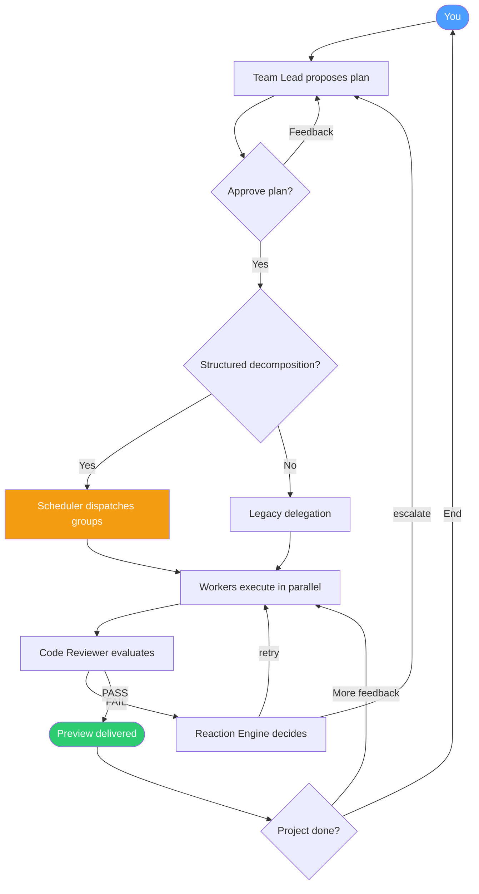

# Team Workflow

This document contains all team-specific behavior used by Open Office.

## High-Level Flow



## Team Phases

| Phase | What happens | User action |
|---|---|---|
| Create | Team Lead gathers intent and scope | Describe what to build |
| Design | Team Lead proposes implementation plan | Approve or request changes |
| Execute | Lead decomposes tasks, scheduler dispatches to workers in parallel | Monitor or cancel |
| Complete | Team returns preview and summary | Give feedback or end project |

## Team Roles

| Role | Responsibility |
|---|---|
| Team Lead | Owns product direction, outputs structured task decomposition, coordinates |
| Developer | Writes and updates code, runs builds/tests, integrates fixes |
| Code Reviewer | Checks quality and requirement alignment, issues PASS/FAIL |

## Task Decomposition (New)

When the Team Lead enters the Execute phase, it outputs a structured `[DECOMPOSITION]` block:

```json
{
  "tasks": [
    { "id": "dev-1", "role": "Developer", "description": "Build the UI" },
    { "id": "dev-2", "role": "Developer", "description": "Build the API" },
    { "id": "review-1", "role": "Code Reviewer", "description": "Review all code" }
  ],
  "groups": [["dev-1", "dev-2"], ["review-1"]]
}
```

- **Tasks**: Each has a unique ID, a role, and a description
- **Groups**: Ordered execution — tasks within a group run **in parallel**, groups run **sequentially**
- **Context injection**: Each worker receives lineage (where their task fits in the plan) and sibling awareness (what other workers are doing in parallel)

If the Lead doesn't output a decomposition block, the system falls back to legacy `@AgentName: task` delegation.

## Agent Selection

The scheduler automatically assigns tasks to available agents:

1. **Exact role match** — idle agent whose role matches the task role
2. **Partial match** — "Senior Developer" matches a "Developer" task
3. **Fallback** — any idle non-lead agent
4. Team Lead is never assigned worker tasks

## Reaction Engine

Automated event-driven responses replace hardcoded retry logic:

| Event | Default Action | After Retries |
|---|---|---|
| Task failed (not timeout) | Retry up to 2x | Escalate to leader |
| Review VERDICT: FAIL | Send to dev for direct fix | Escalate to leader |
| Delegation budget exhausted | Force-finalize | — |
| Agent stuck 5+ minutes | Notify user | — |

Rules are configurable via `OrchestratorOptions.reactions`.

## Workspace Isolation

Each agent works in an isolated **git worktree** with automatic setup:

- Worktrees live outside the repo at `~/.open-office[-dev]/worktrees/<repo-hash>/<agentId>/`
- **PostCreate hooks**: auto-symlink `.env`, `.claude`, auto-install dependencies
- **Merge control**: per-agent auto-merge toggle + undo stack
- **Conflict resolution**: sync (main wins) vs merge (agent wins)

See `packages/orchestrator/README.md` for full worktree documentation.

## Control Loops

- **Design loop**: Lead iterates on plan until approval
- **Decomposition loop**: Lead breaks tasks into groups, scheduler dispatches
- **Review loop**: Reviewer sends fixes back to Developer (bounded by reaction rules)
- **Stuck detection**: Polling detects idle agents, triggers notification
- **Delivery loop**: User reviews preview, requests changes, or closes

## Preview Resolution

When work is marked complete, Open Office tries to make output immediately viewable:

| Output type | Resolution behavior |
|---|---|
| Static files (`html/css/js`) | Served directly |
| Build artifacts (`dist/`, `out/`) | Served as static site |
| Runnable service (Express/Flask/etc.) | Launches service and resolves preview URL |

## Default Team Presets

| Name | Team Role | Default profile |
|---|---|---|
| Marcus | Lead | Vision-first coordinator |
| Leo | Developer | Action-first implementation |
| Sophie | Reviewer | Careful code quality review |
| Alex | Developer | Frontend focus |
| Mia | Developer | Backend focus |
| Kai | Developer | Game-dev focus |

## Notes

- Team behavior is orchestrated by `packages/orchestrator`.
- Task decomposition, scheduling, reactions, and workspace isolation are handled by the orchestrator's plugin modules.
- See `packages/orchestrator/README.md` for the full module architecture.
