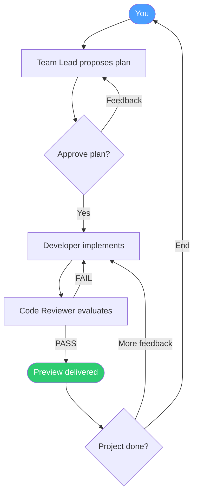

# Team Workflow

This document contains all team-specific behavior used by Bit Office.

## High-Level Flow

## Team Phases

| Phase | What happens | User action |
|---|---|---|
| Create | Team Lead gathers intent and scope | Describe what to build |
| Design | Team Lead proposes implementation plan | Approve or request changes |
| Execute | Developer implements and Reviewer validates | Monitor or cancel |
| Complete | Team returns preview and summary | Give feedback or end project |

## Team Roles

| Role | Responsibility |
|---|---|
| Team Lead | Owns product direction, breaks work down, coordinates delegation |
| Developer | Writes and updates code, runs builds/tests, integrates fixes |
| Code Reviewer | Checks quality and requirement alignment, issues PASS/FAIL |

## Control Loops

- Design loop: Lead iterates on plan until approval
- Review loop: Reviewer sends fixes back to Developer (bounded retry cycles)
- Delivery loop: User reviews preview, requests changes, or closes the task

## Preview Resolution

When work is marked complete, Bit Office tries to make output immediately viewable:

| Output type | Resolution behavior |
|---|---|
| Static files (`html/css/js`) | Served directly |
| Build artifacts (`dist/`, `out/`) | Served as static site |
| Runnable service (Express/Flask/etc.) | Launches service and resolves preview URL |

## Default Team Presets

| Name | Team Role | Default profile |
|---|---|---|
| Marcus | Lead | Vision-first coordinator |
| Leo | Developer | Action-first implementation |
| Sophie | Reviewer | Careful code quality review |
| Alex | Developer | Frontend focus |
| Mia | Developer | Backend focus |
| Kai | Developer | Game-dev focus |

## Notes

- Team behavior is orchestrated by `packages/orchestrator`.
- Prompting, delegation, result finalization, and retry boundaries are handled in the orchestrator runtime.
